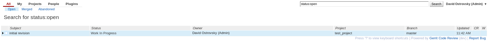
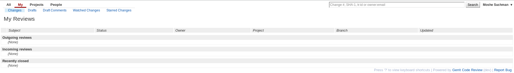
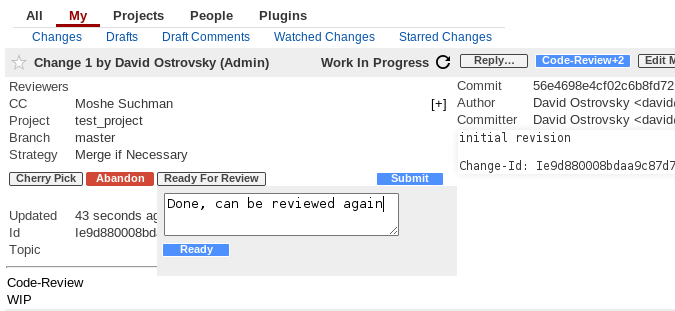

Gerrit Work in Progress plugin
==============================

It adds a new button that allows an authorized user to set a
change to Work In Progress, and a button to change from WIP back
to a "Ready For Review" state. Any change in the WIP state will not
show up in anyone's Review Requests. Pushing a new patchset will
reset the change to Review In Progress.

Optionally it can be used in combination with new "Change Owners"
group. The plugin owned capability "Work In Progress" can be granted
to that group, so that only "Change Owners" can toggle the WIP state.

WIP Workflow
------------

Turn normal change to WIP and provide description why:

New comment message:

Ready For Review button is shown for WIP change:

The change is shown with status "Work In Progress" on change list:

Reviewers Dashboard filters the WIP changes:

Mark it as Ready For Review:

Comments are updated correspondingly:

Reviewers Dashboard shows that change again:

Known limitations
-----------------

Old change screen doesn't support JS API. So that the popup dialog is not shown
if "Work In Progress" and "Ready In Review" buttons are used and no comments
can be provided. New change screen should be used for best experience with
WIP Workflow plugin. 

Authorship
----------

This plugin is based on previous work of David Shrewsbury:
https://gerrit-review.googlesource.com/36091
